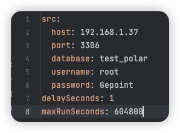
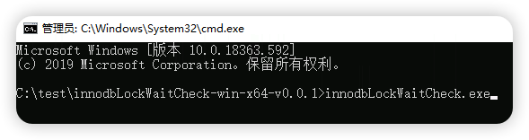
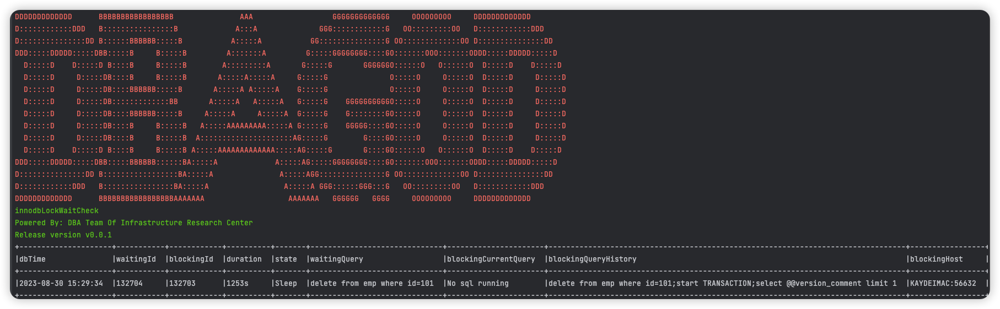
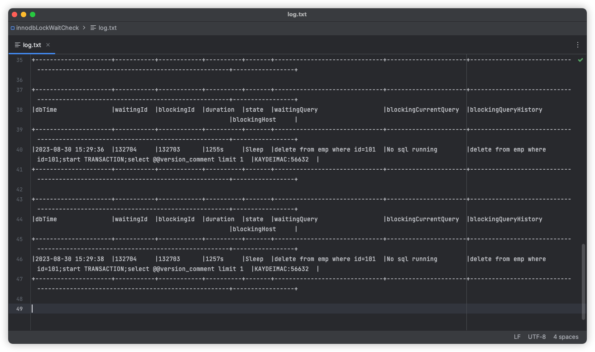

# MySQL row lock timeout monitoring tool
([CN](https://github.com/iverycd/innodbLockWaitCheck/blob/master/readme_cn.md))
## Introduction

```
#### 20230819 10:10:10,234 | com.alibaba.druid.filter.logging.Log4jFilter.statementLogError(Log4jFilter.java:152) | ERROR |  {conn-10593, pstmt-38675} execute error. update xxx set xxx = ? , xxx = ?  where RowGuid = ?
com.mysql.jdbc.exceptions.jdbc4.MySQLTransactionRollbackException: Lock wait timeout exceeded; try restarting transaction
```

The above error is definitely unfamiliar to colleagues who lack experience in database development. When encountering this error for the first time, they may not know how to handle it, whether it is a code issue or not. Many people may feel that the database is abnormal or if there is something wrong, so they should urgently seek treatment from the DBA.

Now let's popularize the science again. This error is lock wait timeout, which is mainly divided into [row lock wait timeout] and [metadata lock wait timeout] according to the type of lock.

Row lock wait timeout: When SQL times out due to waiting for row locks, it is called row lock wait timeout, which often occurs in multi concurrent transaction scenarios.

Metadata lock wait timeout: When SQL times out while waiting for a metadata lock, it is considered a metadata lock wait timeout, which often occurs during DDL operations.


For the row locks that encounter the most scenarios, to put it simply, lock timeout means that you have been queuing in the cafeteria for too long. A group of people are waiting in the cafeteria to pick up vegetables, getting spoons ready to go to the dish. However, if the person in front is too slow to pick up vegetables or standing there doing nothing, the person behind is waiting. In this case, everyone should understand. Of course, the database locking mechanism is not as simple as queuing in the cafeteria.

## How to use

Unzip to any directory

1 Please use `Notepad++` or other text tools to edit the yml format file `dbcfg. yml`

Configure Database Connection
Where `delaySeconds` is the monitoring interval in seconds. If it is 1, the database is monitored every 1 second

`maxRunSeconds`It is the maximum running time of tool monitoring, in seconds. If it is 604800, it means 7 days. After 7 days, the program will automatically exit and no longer be monitored



2 running tools

After decompression, enter `cmd` in the address bar of the tool directory and press Enter to call the cmd window




3 row lock information

If the database has row locks and other information, terminals such as cmd will have corresponding `thread_id` and `SQL`information, otherwise the output is `No row lock info`



4 log file

The line lock information monitored by the tool will be dumped to the `log.txt` file in the same path




## How to analyze

The output results in the tool will display the following columns, as shown below:

`dbTime`:The current time of the database

`waitingId`:等待的线程id(即被阻塞的MySQL线程)

`blockingId`:The waiting thread ID (i.e. the blocked MySQL thread)

`duration`:Row lock waiting time, in seconds

`state`: The state of the thread, if it is `Sleep`, indicates that the current transaction is not executing `SQL`

`waitingQuery`: The `SQL` waiting for execution is the `SQL` that is blocked`

`blockingCurrentQuery`: The source of the blockage is `SQL`. If it is `No SQL running`, it indicates that the current transaction is not executing `SQL`. It is very likely that the corresponding program does not do anything or commit transactions after executing SQL code.

`blockingQueryHistory`: This is a historical `SQL` statement executed under the blocking source thread, with a maximum of 10 SQL statements recorded, each with a semicolon Separation, arranged in descending chronological order, where the most recently executed `SQL` is on the far left and the latest executed `SQL` is on the far right

`blockingHost`: The host name of the blocking source

In case studies on projects, it is often necessary to pay attention to the `blockingQueryHistory` column, because many transactions do not do anything or commit transactions after SQL execution, and the connection is always maintained. Therefore, this historical execution record needs to be used to assist in analysis, for example

`blockingQueryHistory`:

`select count(*) from emp where id=1;select count(*) from emp where id=2;select @@version_comment limit 1 `

It can be seen that in the historical execution of SQL, there are `select` query statements ` select count (*) `. Many people naively think that only queries can block, but little do they know that ` MySQL` is in the transaction information view` events_Statements_History` can only support 10 historical SQL by default, so in this case, after executing the update or delete operation and then executing other select query operations, now that you know the history operation of SQL, you can perform logical reasoning and investigate which method in the code the executed SQL originates from