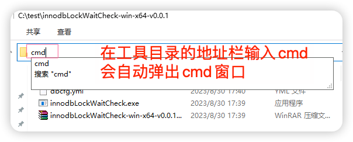

# MySQL行锁超时监控工具
## 一. 背景

```
#### 20230819 10:10:10,234 | com.alibaba.druid.filter.logging.Log4jFilter.statementLogError(Log4jFilter.java:152) | ERROR |  {conn-10593, pstmt-38675} execute error. update xxx set xxx = ? , xxx = ?  where RowGuid = ?
com.mysql.jdbc.exceptions.jdbc4.MySQLTransactionRollbackException: Lock wait timeout exceeded; try restarting transaction
```

上述这个错误，对于缺少数据库开发经验的同事来说肯定很陌生，第一次遇到这个报错可能都不知道如何下手，是不是代码问题，很多人都会觉得数据库是不是不正常，是不是出了什么问题，赶紧找DBA处理。

现在再科普一下，这个报错为锁等待超时，根据锁的类型主要细分为【行锁等待超时】与【元数据锁等待超时】。

【行锁等待超时】：当SQL因为等待行锁而超时，那么就为行锁等待超时，常在多并发事务场景下出现。

【元数据锁等待超时】：当SQL因为等待元数据锁而超时，那么就为元数据锁等待超时，常在DDL操作期间出现。

对于遇到场景最多的行锁，说简单点，锁超时就是你在食堂排队时间太久了，一堆人在食堂打菜，拿到打菜的勺子准备去菜盘里打菜，奈何前面人打菜太慢或者打了菜站在那里无所事事后面人一直在等，这么讲的话应该所有人都能明白，当然数据库的锁机制可不止食堂排队这么简单。

MySQL数据库不会主动的去记录行锁超时到日志，另外很多没有经验的同事也不知道用什么SQL语句去查数据库的锁，出了问题当时也没有用SQL语句查，那么现在开发了一个小工具，可以对MySQL进行持续监控行锁等信息，等下次问题再复现的时候，获取到SQL，再去对应的代码方法中排查。

## 二. 如何使用

解压到任意目录

1 请使用`Notepad++`或者其他文本工具编辑yml格式文件`dbcfg.yml`

配置数据库连接
其中`delaySeconds`是监控间隔单位是秒，如果是1即每隔1秒监控下数据库

`maxRunSeconds`是工具监控的最大运行时间，单位是秒，如果是604800即7天，7天之后程序会自动退出不再监控


2 运行工具

解压之后在工具目录的地址栏输入`cmd`并按回车调用cmd窗口



在`cmd`调用`innodbLockWaitCheck.exe`


3 查看信息

如果数据库有行锁等信息，cmd等终端会有对应的`thread_id`还有`sql`等信息，否则输出是`No row lock info`


4 本地日志

工具监控到的行锁信息都会转储到同路径下的`log.txt`文件


## 三. 如何分析
大家可以最小化这个工具，等问题再次复现的时候，查看`log.txt`文件

工具中输出结果会展示以下列，示意如下:

`dbTime`:数据库的当前时间

`waitingId`:等待的线程id(即被阻塞的MySQL线程)

`blockingId`:阻塞的线程id(即阻塞的源头)

`duration`:行锁等待时间，单位秒

`state`: 线程的状态，如果是`Sleep`，说明当前事物不在执行`sql`

`waitingQuery`: 正在等待执行的`sql`即被阻塞的`sql`

`blockingCurrentQuery`: 阻塞的源头`sql`,如果为`No sql running`，说明当前事物不在执行`sql`，很可能，对应程序上就是sql代码执行之后啥都不干，也不提交事务。

`blockingQueryHistory`: 这个是阻塞源头线程下执行的历史`sql`语句，最多记录10个sql语句，每个sql语句按分号`;`分隔，按照时间降序排列，即最近执行的`sql`在最左边，最晚执行的`sql`在最右边

`blockingHost`: 阻塞源头的主机名

项目上的案例，往往需要关注下`blockingQueryHistory`这一列，因为很多事务里的sql执行之后就啥都不干，也不提交事务，连接一直保持着，就需要通过这个历史执行记录辅助分析，举个例子

`blockingQueryHistory`结果是

`select count(*) from emp where id=1;select count(*) from emp where id=2;select @@version_comment limit 1 `

可以看到历史执行sql里是`select`查询语句`select count(*) `,很多人天真的以为仅仅是查询怎么会阻塞，殊不知`MySQL`在事务信息视图`events_statements_history`默认只能支持10条历史`sql`，所以这种情况就是执行了`update或者delete`操作之后又执行了其他`select`查询操作，那么既然知道了`sql`的历史操作反过来进行逻辑推理，排查下执行的`sql`源自于代码中的哪个方法即可